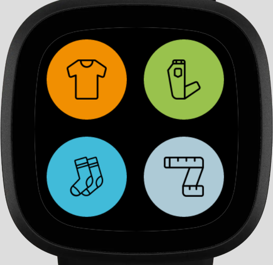
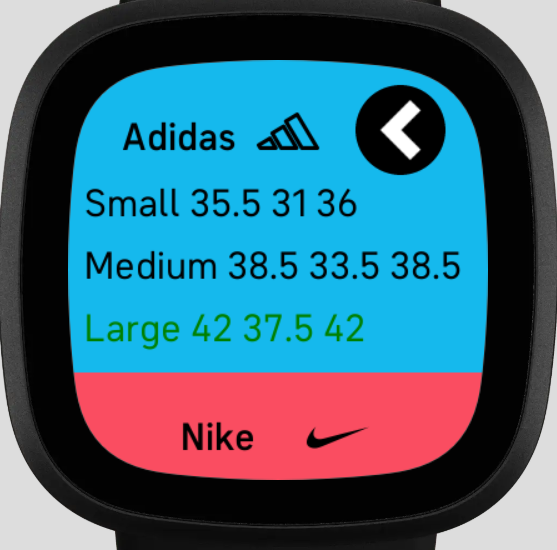

# Fitbit-Shopping-Assistant
## Description

The fitbit shopping assistant is an app built on the Fitbit SDK. It uses the user's body dimensions (waist, hips, chest, inseam etc) inputed in the companion app to calculate the best fit of clothing for each brand and gender for shirts pants and socks. By doing so, one does not have to waste time trying on different sizes of clothing when visiting the mall as the best fit is already given to them. Currently, there are not too many brands that I have added to the app; if there is a demand for it, I will add some more. 

## Screenshots





## Installation on Fitbit

This app is compatible on the Fitbit Versa 3 and Fitbit Sense as they both run on Fitbit SDK 5.0. The app is public and approved by Fitibit. Thus, it is accessible on the Fitbit app gallery for download through this link: https://gallery.fitbit.com/en-ca/details/fbb7a8ca-633e-4629-b31a-2f22687dd64b.

## Installiation Through Source Code

To build or test this app on a computer, you need the Fitbit OS Simulator. Using shell or git, type ```npm install```. Then use cd and go to the directory where you have downloaded the source code. Then type ```npx fitbit``` (you have to have logged onto Fitbit on your web browser). Type ```build``` and then type ```install``` 

## Usage

Go onto the companion app on your phone and you should be able to input your body dimensions and gender there. From there, the Fitbit app will automatically update with new recommendations for the size of clothing you should wear for example a small size of a Nike t-shirt. 
